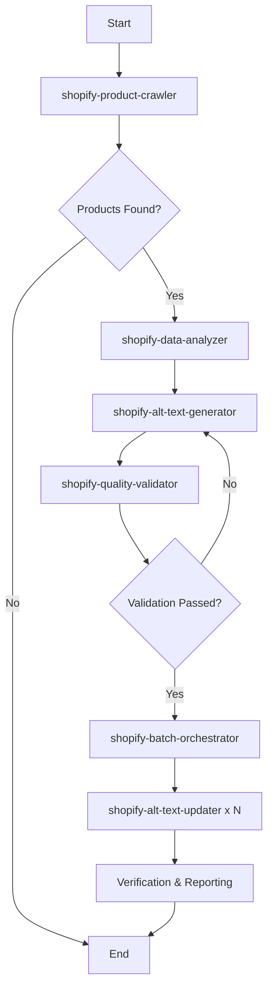

# Shopify Alt Text Multi-Agent Workflow

## Overview
This master workflow orchestrates multiple specialized agents to automate Shopify product image alt text generation at scale. The system uses parallel processing to efficiently handle thousands of products while maintaining high quality and API compliance.

## 🎯 Complete Workflow Architecture



## 🚀 Quick Start Commands

### Full Automated Workflow
```bash
# Run complete workflow with Sonnet + Opus fallback
claude -p --model sonnet --fallback-model opus "Execute complete Shopify alt text workflow for store: {STORE_URL}"
```

### Individual Agent Commands
```bash
# 1. Crawl for products missing alt text
claude -p --model sonnet "Use shopify-product-crawler to find products without alt text"

# 2. Analyze product data
claude -p --model sonnet "Use shopify-data-analyzer to extract product attributes"

# 3. Generate alt text
claude -p --model sonnet "Use shopify-alt-text-generator to create SEO-optimized alt text"

# 4. Validate quality
claude -p --model sonnet "Use shopify-quality-validator to check alt text quality"

# 5. Orchestrate batch updates
claude -p --model opus "Use shopify-batch-orchestrator to process all validated products"

# 6. Individual updater (spawned automatically by orchestrator)
claude -p --model sonnet "Use shopify-alt-text-updater for batch 1"
```

## 📊 Agent Capabilities

### 1. **shopify-product-crawler**
- Connects to Shopify API
- Scans entire product catalog
- Identifies missing/poor alt text
- Outputs: `products_missing_alt_text.json`

### 2. **shopify-data-analyzer**
- Extracts product attributes
- Mines descriptions for keywords
- Categorizes by product type
- Outputs: `products_with_attributes.json`

### 3. **shopify-alt-text-generator**
- Applies intelligent templates
- Creates SEO-optimized text
- Ensures accessibility compliance
- Outputs: `products_with_alt_text.json`

### 4. **shopify-quality-validator**
- Validates SEO compliance
- Checks accessibility standards
- Scores and approves/rejects
- Outputs: `products_validated_alt_text.json`

### 5. **shopify-batch-orchestrator**
- Calculates optimal batching
- Spawns parallel updater agents
- Monitors progress in real-time
- Outputs: `batch_update_report.json`

### 6. **shopify-alt-text-updater**
- Processes assigned batch
- Updates via Shopify API
- Handles rate limiting
- Outputs: `batch_X_results.json`

## 🔧 Configuration

### Environment Variables
```bash
export SHOPIFY_STORE_URL="your-store.myshopify.com"
export SHOPIFY_API_TOKEN="your-api-token"
export BATCH_SIZE=100
export MAX_PARALLEL_AGENTS=10
```

### Directory Structure
```
Shopify-Alt-Text/
├── agents/
│   ├── shopify-product-crawler.md
│   ├── shopify-data-analyzer.md
│   ├── shopify-alt-text-generator.md
│   ├── shopify-quality-validator.md
│   ├── shopify-batch-orchestrator.md
│   └── shopify-alt-text-updater.md
├── data/
│   ├── crawl_results/
│   ├── analyzed/
│   ├── generated/
│   ├── validated/
│   ├── batch_results/
│   └── orchestration/
└── shopify-alt-text-master-workflow.md
```

## 📈 Performance Metrics

### Processing Capacity
- **Small Store** (< 1,000 products): ~5-10 minutes
- **Medium Store** (1,000-5,000 products): ~15-30 minutes
- **Large Store** (5,000-10,000 products): ~45-60 minutes
- **Enterprise** (10,000+ products): ~1-2 hours

### Parallel Processing
- 10 concurrent updater agents
- 100 products per batch
- 2 API calls/second rate limit
- Automatic retry on failures

## 🛡️ Quality Assurance

### Alt Text Standards
- 80-125 characters optimal
- Primary keyword included
- Natural language flow
- Accessibility compliant
- Brand consistency

### Validation Thresholds
- **Auto-Approved**: Score ≥ 85
- **Review Required**: Score 70-84
- **Regenerate**: Score < 70

## 📝 Example Workflow Execution

```bash
# Start the complete workflow
claude -p --model sonnet --fallback-model opus "
Execute complete Shopify alt text workflow:
1. Crawl products from store: xtend-outdoors.myshopify.com
2. Analyze and generate alt text for all products missing it
3. Validate quality with strict SEO standards
4. Update all approved products in parallel batches
5. Generate comprehensive report
"
```

## 🔄 Continuous Improvement

### Monthly Maintenance
```bash
# Re-scan for new products
claude -p --model sonnet "Scan for new products added since last run"

# A/B test new templates
claude -p --model sonnet "Test new alt text templates on sample products"

# Analyze SEO impact
claude -p --model sonnet "Generate SEO performance report for updated products"
```

## 🚨 Error Handling

### Common Issues & Solutions
1. **API Rate Limits**: Automatic backoff implemented
2. **Network Errors**: 3 retry attempts with exponential delay
3. **Invalid Products**: Logged and skipped
4. **Validation Failures**: Sent back for regeneration

## 📊 Reporting

### Final Report Includes
- Total products processed
- Success/failure rates
- Processing time metrics
- SEO score improvements
- Failed products list
- Recommendations for manual review

## 🎯 Best Practices

1. **Run during off-peak hours** to minimize store impact
2. **Test on staging first** if available
3. **Backup existing alt text** before bulk updates
4. **Monitor first batch** before full automation
5. **Review flagged items** for quality assurance

---

*This multi-agent workflow ensures efficient, high-quality alt text generation at scale while maintaining SEO and accessibility standards.*